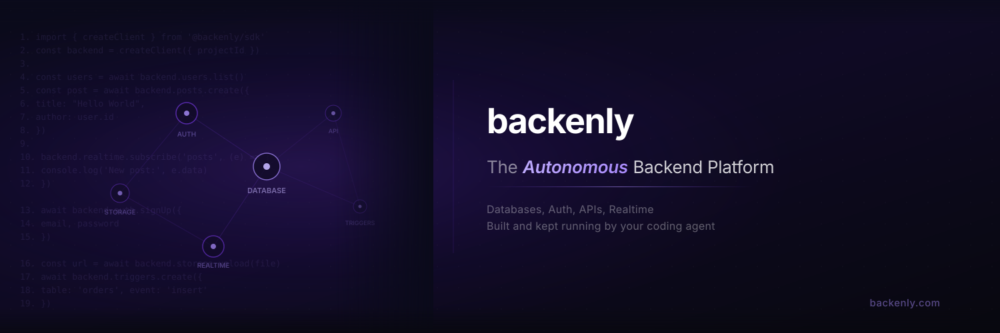

<div align="center">



### Your coding agent builds it. Backenly keeps it running.

An autonomous backend platform: PostgreSQL, REST APIs, auth, storage, realtime,
and functions, driven by your coding agent over MCP. Every change is planned,
verified, and reversible.

<br/>

[](LICENSE)
[](packages/)
[](https://github.com/backenly/backenly/stargazers)

[](https://x.com/Backenly)
[](https://www.linkedin.com/company/117034579)
[](https://discord.gg/backenly)
[](https://github.com/backenly/backenly)

**[backenly.com](https://backenly.com)** &nbsp;·&nbsp; [Quickstart](https://backenly.com/quickstart) &nbsp;·&nbsp; [Client libraries](https://github.com/backenly/backenly-js)

</div>

> ⭐ **Star the repo** to follow releases and help other builders find Backenly.

---

## What this is

Most backend platforms hand you primitives and leave you owning schema design,
API wiring, RLS policies, monitoring, and recovery. Newer agent-native backends
hand an agent raw SQL and no safety net.

Backenly does neither. You describe the product you're building through the
coding agent you already use (Claude Code, Cursor, Codex) over an MCP server.
Backenly derives the data model, generates the endpoints, writes the policies,
applies the change, and then **verifies it against the live runtime**. A
continuous autonomy loop keeps watching after that, repairing drift, missing
indexes, broken triggers, and RLS gaps on its own.

The distinction that matters: Backenly does not just *generate* backend
resources, it *manages backend change safely*. Every mutation, whether it comes
from an agent, from the dashboard, or from an automated repair, goes through one
typed action kernel with dry-run, audit, and rollback. There is deliberately no
raw-SQL path for mutating structure. Reads are standard SQL, and your data is
never locked in: direct Postgres connection strings and full `pg_dump` exports
are one command away.

## How it works

<div align="center">
  
</div>

- **Intent-first.** An LLM planner derives entities, relations, and actions from
  natural language. No table designer, no hand-written migrations.
- **One governed kernel.** Every mutation flows through `executeAction`, so the
  agent's model of the database and the database itself cannot silently diverge.
- **Closed-loop autonomy.** The loop heals the reversible safe band by itself.
  Anything risky, such as auth, external credentials, or destructive and
  irreversible changes, always waits for a human.
- **Multi-tenant by construction.** Each project gets its own PostgreSQL schema
  (`workspace_{projectId}`). Isolation is enforced by Postgres grants and RLS,
  never by application-level string filtering.
- **PostgREST data plane.** Tables are served through PostgREST, so the query
  grammar you already know works unchanged.

## Quick start

Requires Node 20+, and Docker (or your own PostgreSQL 14+ instance).

```bash
git clone https://github.com/backenly/backenly.git
cd backenly
npm install

cp .env.example .env          # then set OPENAI_API_KEY and JWT_SECRET

# PostgreSQL + Redis, matching the defaults already in .env.example
docker compose -f docker-compose.dev.yml up -d

npm run db:generate && npm run db:push
npm run dev                   # dashboard :3000 · runtime :3001
```

`npm run dev` starts both processes together. If you already have PostgreSQL
running, skip the Docker step and point `DATABASE_URL` at it instead.

Two variables are not optional:

- `JWT_SECRET` signs every platform session. Generate one per deployment with
  `openssl rand -hex 32`.
- `OPENAI_API_KEY` powers planning and the autonomy loop.

See [`.env.example`](.env.example) for the rest.

## Connecting a coding agent

Backenly is built to be driven over MCP. Point your agent at the MCP server:

```bash
npx @backenly/mcp-server init
```

Then describe what you want. The SDK is for the app you ship:

```js
const backend = new BackenlyClient({ projectId, apiKey })
await backend.auth.signUp({ email, password })
await backend.posts.create({ title: 'Hello' })
await backend.posts.list({ filter: { published: true } })
```

## Repository layout

| Path | What lives there |
|------|------------------|
| `app/` | Next.js routes: dashboard UI, platform APIs, and the public `/api/v1/*` runtime |
| `lib/ai/` | The Brain: planning, the tool loop, and `executeAction`, the governed mutation kernel |
| `lib/orchestration/` | The nine-phase pipeline from intent to verified change |
| `lib/autonomy/` | The MAPE-K loop that monitors and repairs running backends |
| `lib/execution/` | Schema writes, migrations, and rollback beneath the kernel |
| `lib/tenant/` | Schema isolation and the tenant boundary |
| `packages/` | Client libraries: SDK, CLI, MCP server (MIT) |
| `prisma/` | Platform schema: the `public` schema, not tenant data |
| `server/` | Express runtime serving the end-user API |

[`AGENTS.md`](AGENTS.md) is the deeper architectural guide, and is written for
coding agents working in this repo as much as for people.

## Self-hosting vs Cloud

Self-hosting is free and complete. This repository is the whole platform:
runtime, governance, and the full self-healing engine, not a stripped community
edition. You bring the servers, the Postgres, and the OpenAI key.

[Backenly Cloud](https://backenly.com/pricing) runs the same codebase, and
handles infrastructure, backups, upgrades, and the autonomy tokens. `pg_dump`
moves your data between the two in either direction.

## Contributing

**We are not merging external pull requests yet** while Backenly is in early
access. The best way to help right now is to open an issue: bug reports, feature
requests, and questions are all welcome. See [CONTRIBUTING.md](CONTRIBUTING.md)
for the full guide, including the checklist for when pull requests open.

Tests run against a real PostgreSQL instance. The database is never mocked,
because mocking it has caused production incidents here before.

## Security

Please do not open a public issue for a security problem. See
[SECURITY.md](SECURITY.md) for the private reporting route.

## License

The platform is licensed under the [Apache License 2.0](LICENSE).

The client libraries under [`packages/`](packages/), the SDK, CLI, and MCP
server, are MIT, so they impose nothing on the applications that embed them.
