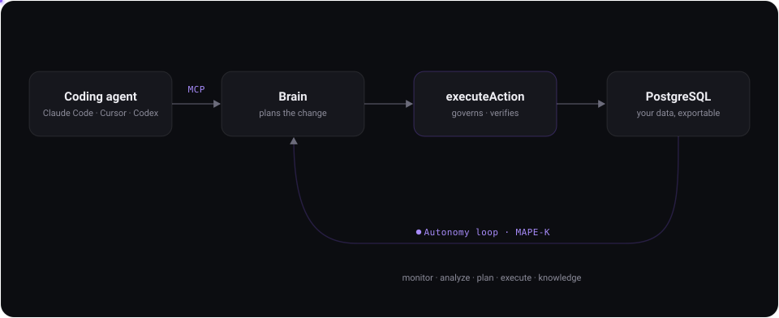

<div align="center">


# Backenly

### Your coding agent builds it. Backenly keeps it running.

The autonomous backend platform for agentic coding. PostgreSQL, REST APIs, auth,
storage, realtime, and functions, driven by your coding agent over MCP, with every
change planned, verified, and reversible.

<br/>

[](LICENSE)
[](packages/)
[](https://www.npmjs.com/package/@backenly/mcp-server)
[](https://github.com/backenly/backenly/graphs/contributors)
[](https://github.com/backenly/backenly/stargazers)

[](https://x.com/Backenly)
[](https://www.linkedin.com/company/117034579)
[](https://github.com/backenly/backenly)

**[backenly.com](https://backenly.com)** &nbsp;·&nbsp; [Resources](https://backenly.com/resources) &nbsp;·&nbsp; [Pricing](https://backenly.com/pricing) &nbsp;·&nbsp; [Client libraries](https://github.com/backenly/backenly-js)

https://github.com/user-attachments/assets/2b215d72-4b1b-4a4c-8290-a94553be192d

</div>

> ⭐ **Star the repo** to follow releases and help other builders find Backenly.

---

## What this is

Most backend platforms hand you primitives and leave you owning schema design,
API wiring, RLS policies, monitoring, and recovery. Newer agent-native backends
hand an agent raw SQL and no safety net.

Backenly does neither. You describe the product you're building through the
coding agent you already use (Claude Code, Cursor, Codex) over an MCP server.
Backenly derives the data model, generates the endpoints, writes the policies,
applies the change, and then **verifies it against the live runtime**. A
continuous autonomy loop keeps watching after that, repairing drift, missing
indexes, broken triggers, and RLS gaps on its own.

The distinction that matters: Backenly does not just *generate* backend
resources, it *manages backend change safely*. Every mutation, whether it comes
from an agent, from the dashboard, or from an automated repair, goes through one
typed action kernel with dry-run, audit, and rollback. There is deliberately no
raw-SQL path for mutating structure. Reads are standard SQL, and your data is
never locked in: direct Postgres connection strings and full `pg_dump` exports
are one command away.

## How it works

<div align="center">
  
</div>

- **Intent-first.** An LLM planner derives entities, relations, and actions from
  natural language. No table designer, no hand-written migrations.
- **One governed kernel.** Every mutation flows through `executeAction`, so the
  agent's model of the database and the database itself cannot silently diverge.
- **Closed-loop autonomy.** The loop heals the reversible safe band by itself.
  Anything risky, such as auth, external credentials, or destructive and
  irreversible changes, always waits for a human.
- **Multi-tenant by construction.** Each project gets its own PostgreSQL schema
  (`workspace_{projectId}`). Isolation is enforced by Postgres grants and RLS,
  never by application-level string filtering.
- **PostgREST data plane.** Tables are served through PostgREST, so the query
  grammar you already know works unchanged.

## Core capabilities

| Capability | What you get |
|---|---|
| **Database** | PostgreSQL with a schema per project, served through PostgREST |
| **Auth & Users** | Email/password and social sign-in, JWT sessions, RLS-forced user tables |
| **Storage** | Public and private buckets with per-file access control |
| **Realtime** | Shared `LISTEN`/`NOTIFY` hub for table change subscriptions |
| **Functions** | Serverless route modules, validated before they ship and self-healed if they break |
| **Integrations** | One `ctx.integrations.<id>.request()` surface for third-party APIs |
| **Autonomy** | MAPE-K loop that observes, detects, proposes, applies, and verifies repairs |
| **Monitoring** | Request logs with stability and reliability scoring |
| **Branches** | Preview branches with their own sequences, plus diff and merge |
| **Deploy** | Governed rollout with restore points and an audit ledger |

## What your agent can actually do

The MCP server advertises **20 tools**. The catalog is capped deliberately, because
tool-selection accuracy degrades as it grows, while the dispatcher stays wider so an
agent pinned to an older manifest never gets a 404.

| Group | Tools |
|---|---|
| **Understand** | `read_backend_state` · `get_table_schema` · `run_query` · `fetch_docs` |
| **Build** | `apply_migration` · `enable_auth` · `set_rls` · `create_bucket` · `generate_function` · `enable_realtime` |
| **Data** | `db_insert` · `db_update` · `db_delete` |
| **Operate** | `branch` · `create_api_key` · `set_env_var` · `get_database_credentials` · `check_approval` · `generate_types` |
| **Natural language** | `backend_chat`, the fall-through for anything not named above |

Agents can also browse live project state as MCP **resources** (`backenly://state`,
`tables`, `apis`, `buckets`, `triggers`) instead of spending a tool call to ask.

## Quick start

### Cloud

Create a project at **[backenly.com](https://backenly.com)**, then point your agent
at it. Nothing to install or operate.

### Self-hosted

One deployment is one project. `npm run bootstrap` provisions that project, and
it is a reconciler rather than an installer: rerunning it repairs whatever is
missing and changes nothing else. You will run it at least twice, and that is
the intended path, not a failure.

Requires Node 20+, PostgreSQL 14+, and PostgREST. Docker covers the first two.

> **Use a PostgreSQL cluster dedicated to this deployment.**
>
> PostgREST authenticates through cluster-global roles, and the list of schemas
> it serves is stored as a role setting with no `IN DATABASE` scope. Two
> Backenly databases on one cluster therefore overwrite each other's
> served-schema registry, and the loser's data plane answers `PGRST106` on every
> table. This is a known limitation being redesigned, not something you can
> configure around. A container or a separate instance is enough.

#### 1. Install

```bash
git clone https://github.com/backenly/backenly.git
cd backenly
npm install
cp .env.example .env

# A dedicated PostgreSQL + Redis, matching the defaults already in .env.example
docker compose -f docker-compose.dev.yml up -d
```

Then set these in `.env`:

```bash
DATABASE_URL=postgresql://<role>:<password>@<host>:5432/<db>
BACKENLY_EDITION=single-tenant   # the default is still `cloud`; it flips in a later release
BACKENLY_PROJECT_ID=<uuid>       # any UUID, e.g. `uuidgen`
JWT_SECRET=<openssl rand -hex 32>
OPENAI_API_KEY=<your key>
```

`BACKENLY_PROJECT_ID` is the identity of this deployment and must never change
afterwards: it names the `workspace_<uuid>` schema your tables live in. Bootstrap
refuses to run against a database that already holds a different one. You may
leave it unset and pin the id bootstrap generates instead, but then step 4's
command has to be copied from bootstrap's output rather than from here.

`JWT_SECRET` signs every platform session; generate one per deployment.
`OPENAI_API_KEY` powers planning and the autonomy loop. See
[`.env.example`](.env.example) for the rest.

#### 2. Tell the database which role Backenly connects as

Only if the role in your `DATABASE_URL` is not literally `backenly_user`:

```bash
psql -c "ALTER DATABASE <db> SET backenly.app_role = '<your role>'"
```

Skipping it on a database whose role is `postgres` makes the next section fail
with `role "backenly_user" does not exist`.

#### 3. Create the tables and bootstrap

```bash
npm run db:generate && npm run db:push
npm run bootstrap
```

**This first run is expected to exit 3.** Bootstrap creates the project row, its
workspace schema and its signing secret, then reports what it cannot install
itself. Its exit code is the state, and deployment automation should read it:

| exit | meaning |
| --- | --- |
| `0` | ready |
| `2` | refused. The database is in a state bootstrap will not touch, either more than one project or a `BACKENLY_PROJECT_ID` that does not match what is already there. Nothing was written. |
| `3` | core bootstrapped, prerequisites still unmet. **Not** ready: the `/db/*` data plane will answer `PGRST106` until step 4 is done. |

#### 4. Install the prerequisites bootstrap cannot install itself

These need a PostgreSQL superuser. Bootstrap prints this same list, with your
real project id filled in; run what it prints.

```bash
# 1. support objects: registry functions, DDL event triggers, and the
#    anon / authenticated / service_role / backenly_authenticator roles.
#    Uses PGDATABASE, which defaults to `backenly`.
bash scripts/postgrest-install.sh

# 2. passwords, role membership and the per-schema grants.
#    Prints the connection string PostgREST authenticates with. Store it: it is
#    not recoverable, and this command will not print it again.
npx tsx scripts/setup-postgrest-roles.ts --project <PROJECT_ID> --apply

# 3. optional. Only needed to hand out direct psql credentials to a project.
#    Backenly is fully operational without it.
psql -d <database> -f scripts/setup-direct-access.sql
```

That order is not arbitrary and cannot be collapsed into one command. The first
command has to create the roles, because the event triggers it installs grant to
them, and a `CREATE SCHEMA` that grants to a role nobody created aborts. The
second grants per workspace schema, so it needs the schema that `npm run
bootstrap` already created above. This is why bootstrap runs, reports NOT ready,
and is rerun: it is a reconciler, and rerunning is the mechanism.

Then start PostgREST against the connection string step 2 printed, and rerun:

```bash
npm run bootstrap
```

**Exit 0 means ready.** Anything else, read what it printed and fix that; it is
safe to rerun as many times as you need.

#### 5. Run it

```bash
npm run dev                   # dashboard :3000 · runtime :3001
```

`npm run dev` starts both processes together. There is no account yet, so sign up
in the dashboard, then run `npm run bootstrap` once more to issue the anon key
your frontend embeds.

#### pg_stat_statements

If you brought your own PostgreSQL rather than the Docker stack above, enable it:

```conf
# postgresql.conf, then restart the server
shared_preload_libraries = 'pg_stat_statements'
```
```sql
CREATE EXTENSION IF NOT EXISTS pg_stat_statements;
```

It is how Backenly finds indexes that are missing by *measurement* — the columns
Postgres is actually spending milliseconds filtering on — rather than only by
schema shape. Without it that check reports itself as unchecked rather than
passing, so nothing claims a guarantee it never evaluated.

## Connecting a coding agent

Backenly is built to be driven over MCP. Point your agent at the MCP server:

```bash
npx @backenly/mcp-server init
```

Works with Claude Code, Cursor, Codex, Cline, and Claude Desktop. Keys are scoped
and revocable, and read-only keys serve a reduced tool set.

> **Restart your MCP host after installing.** Tools stay absent until it
> reconnects, which looks like a broken install but is not one.

Verify the connection by asking your agent:

```
Call Backenly's read_backend_state tool and tell me what exists in this project.
```

Then describe what you want. The SDK is for the app you ship:

```js
const backend = new BackenlyClient({ projectId, apiKey })
await backend.auth.signUp({ email, password })
await backend.posts.create({ title: 'Hello' })
await backend.posts.list({ filter: { published: true } })
```

## Repository layout

| Path | What lives there |
|------|------------------|
| `app/` | Next.js routes: dashboard UI, platform APIs, and the public `/api/v1/*` runtime |
| `lib/ai/` | The Brain: planning, the tool loop, and `executeAction`, the governed mutation kernel |
| `lib/orchestration/` | The nine-phase pipeline from intent to verified change |
| `lib/autonomy/` | The MAPE-K loop that monitors and repairs running backends |
| `lib/execution/` | Schema writes, migrations, and rollback beneath the kernel |
| `lib/tenant/` | Schema isolation and the tenant boundary |
| `packages/` | Client libraries: SDK, CLI, MCP server (MIT) |
| `prisma/` | Platform schema: the `public` schema, not tenant data |
| `server/` | Express runtime serving the end-user API |
| `scripts/` | Operational tooling, probes, and the demo recording pipeline |

[`AGENTS.md`](AGENTS.md) is the deeper architectural guide, and is written for
coding agents working in this repo as much as for people.

## Self-hosting vs Cloud

Self-hosting is free and complete. This repository is the whole platform:
runtime, governance, and the full self-healing engine, not a stripped community
edition. You bring the servers, the Postgres, and the OpenAI key.

[Backenly Cloud](https://backenly.com/pricing) runs the same codebase, and
handles infrastructure, backups, upgrades, and the autonomy tokens. `pg_dump`
moves your data between the two in either direction.

## Contributing

**Pull requests are open and welcome.** Bug reports, feature requests, questions,
and code all help. Good first places to look are open issues, the probe and
detector suite under `lib/autonomy/`, and client library ergonomics in
`packages/`. If a change is large or moves an architectural boundary, open an
issue first so we can agree the approach before you spend the time.

Before opening a PR:

```bash
npm run lint
npx tsc --noEmit
npm test
npx tsx scripts/preflight-oss.ts --tree    # no credentials in what you committed
```

Two things worth knowing before you write code here. Tests run against a real
PostgreSQL instance, and the database is never mocked, because mocking it has
caused production incidents here before. And every schema mutation goes through
`executeAction`; a patch that writes DDL around the kernel will be sent back, no
matter how correct the SQL is.

See [CONTRIBUTING.md](CONTRIBUTING.md) for the full guide.

## Security

Please do not open a public issue for a security problem. See
[SECURITY.md](SECURITY.md) for the private reporting route.

## License

The platform is licensed under the [Apache License 2.0](LICENSE).

The client libraries under [`packages/`](packages/), the SDK, CLI, and MCP
server, are MIT, so they impose nothing on the applications that embed them.

## Trademark

Apache-2.0 §6 grants no rights to the Backenly name or logo, and this project
does not grant them separately. You may fork, modify, self-host, and
commercialise the software. Distributing it under the Backenly name requires
written permission.

Describing your project as "built on Backenly" or "a fork of Backenly" is
accurate and always welcome. See [TRADEMARK.md](TRADEMARK.md) for the full
policy, including what you may do without asking.

---

<div align="center">

**[Star Backenly on GitHub](https://github.com/backenly/backenly)** to get notified about new releases.

</div>
